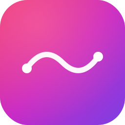

<div align="center">



# SoundFlow Card

**Um card elegante para controlar o Music Assistant a partir do dashboard do Home Assistant.**

[](https://github.com/hacs/integration)
[](https://github.com/soundflow-dev/soundflow-card/releases)
[](LICENSE)

</div>

---

## ✨ Funcionalidades

- 🎵 **Mini player no dashboard** que abre um modal completo ao tocar
- 🎨 **Identidade visual SoundFlow** com gradiente magenta → roxo → violeta
- 🎶 **Descoberta automática de providers** — Apple Music, Spotify, Tidal, YouTube Music, Qobuz, Deezer, TuneIn, e qualquer outro provider configurado no Music Assistant
- 👥 **Suporta múltiplas contas por provider** (ex: várias contas Apple Music)
- 🔍 **Pesquisa contextual** — pesquisa primeiro na biblioteca selecionada, depois no provider
- 📻 **Acesso rápido a rádios favoritas** e itens favoritos do MA
- 🔊 **Controlo de múltiplas colunas** com agrupamento sincronizado do MA
- 🎚️ **Igualar volumes** com um toque (configurável)
- 🌗 **Tema claro/escuro** automático
- 🎯 **Interface focada** — botões grandes e legíveis, otimizada para mobile e desktop

## 📋 Requisitos

- Home Assistant **2024.1.0** ou superior
- Integração [Music Assistant](https://github.com/music-assistant/hass-music-assistant) configurada
- Pelo menos um provider de música configurado no Music Assistant
- Pelo menos um media player exposto pelo Music Assistant

## 📦 Instalação

### Via HACS (recomendado)

1. Abre o HACS no teu Home Assistant
2. Vai a **Frontend** → menu (⋮) no canto superior direito → **Custom repositories**
3. Adiciona este URL: `https://github.com/soundflow-dev/soundflow-card`
4. Categoria: **Lovelace**
5. Clica em **Add** e depois instala "SoundFlow Card"
6. Reinicia o navegador (Ctrl+Shift+R / Cmd+Shift+R)

### Instalação manual

1. Descarrega `soundflow-card.js` da [última release](https://github.com/soundflow-dev/soundflow-card/releases)
2. Coloca o ficheiro em `<config>/www/soundflow-card.js`
3. Adiciona o recurso ao Lovelace:
   - Em **Configuração → Dashboards → Recursos**
   - **URL:** `/local/soundflow-card.js`
   - **Tipo:** JavaScript Module
4. Reinicia o navegador

## 🚀 Utilização

### Configuração mínima

```yaml
type: custom:soundflow-card
```

O card descobre automaticamente os players, providers e contas do Music Assistant. Sem configuração necessária para começar a usar.

### Configuração completa

```yaml
type: custom:soundflow-card
title: SoundFlow                    # opcional, título do card
default_player: media_player.sala_2 # opcional, player de arranque
equalize_volume: 2                  # opcional, percentagem de igualar (default: 2)
players:                             # opcional, restringir lista de colunas
  - media_player.sala_2
  - media_player.cozinha_2
  - media_player.quarto_2
  - media_player.escritorio_2
hide_radio_search: true              # opcional, esconder pesquisa em modo rádio (default: true)
```

### Configuração via UI

O card também pode ser configurado pela UI do Home Assistant. Adiciona um card ao teu dashboard, escolhe **Custom: SoundFlow Card** e configura visualmente.

## 🎨 Capturas de ecrã

<table>
  <tr>
    <td align="center"><strong>Mini player</strong></td>
    <td align="center"><strong>Modal principal</strong></td>
  </tr>
  <tr>
    <td></td>
    <td></td>
  </tr>
  <tr>
    <td align="center"><strong>Popup Fonte</strong></td>
    <td align="center"><strong>Popup Colunas</strong></td>
  </tr>
  <tr>
    <td></td>
    <td></td>
  </tr>
</table>

## 🛠️ Providers suportados

O card adapta-se automaticamente a qualquer provider configurado no Music Assistant. Os seguintes têm ícones e cores específicos:

| Provider | Estado |
|----------|--------|
| Apple Music | ✅ Ícone vermelho |
| Spotify | ✅ Ícone verde |
| Tidal | ✅ Ícone preto/azul |
| Qobuz | ✅ Ícone azul |
| Deezer | ✅ Ícone roxo |
| YouTube Music | ✅ Ícone vermelho |
| TuneIn | ✅ Ícone laranja |
| SoundCloud | ✅ Ícone laranja |
| Plex | ✅ Ícone amarelo |
| Jellyfin | ✅ Ícone roxo |
| Subsonic | ✅ Ícone vermelho |
| Local Files | ✅ Ícone neutro |
| Outros | ✅ Ícone genérico de música |

## 🐛 Reportar problemas

Se encontrares um bug ou tiveres uma sugestão, por favor abre uma [issue](https://github.com/soundflow-dev/soundflow-card/issues) com:

- Versão do SoundFlow Card
- Versão do Home Assistant
- Versão do Music Assistant
- Descrição do problema e passos para reproduzir
- Capturas de ecrã se aplicável

## 📄 Licença

[MIT](LICENSE)

## 💚 Créditos

Construído sobre a fantástica [integração Music Assistant](https://github.com/music-assistant/hass-music-assistant) para Home Assistant.

---

<div align="center">

Feito com 🎵 para a comunidade Home Assistant

</div>
