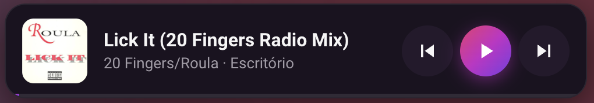
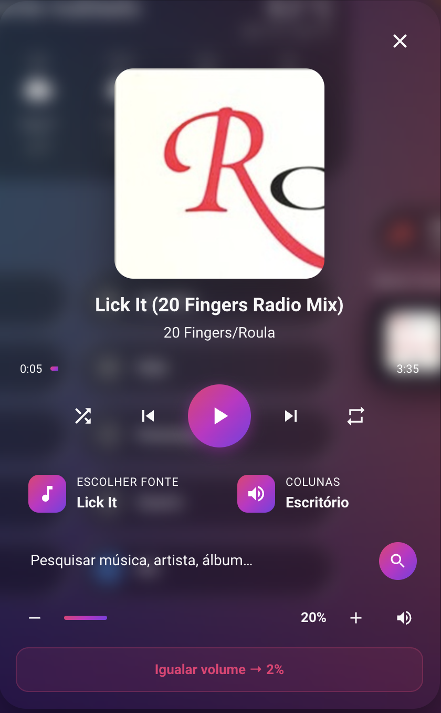
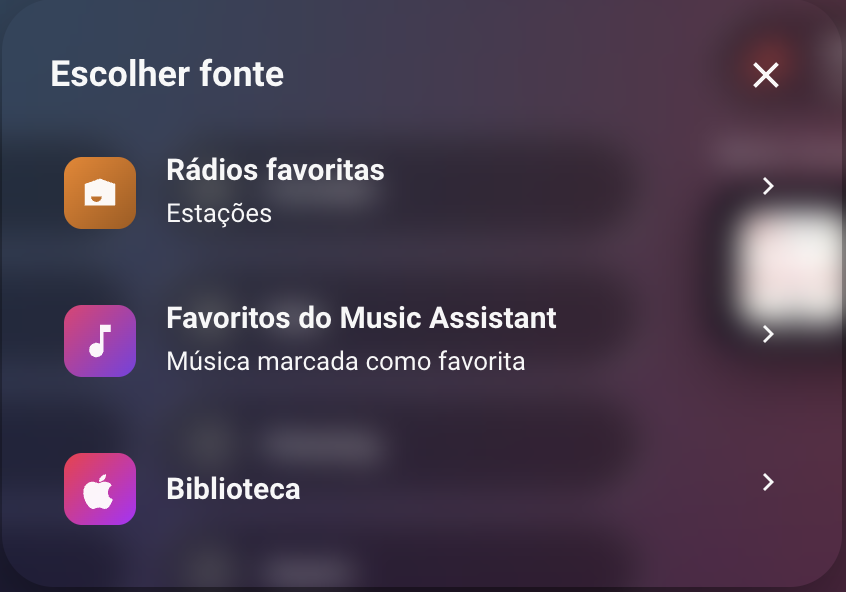
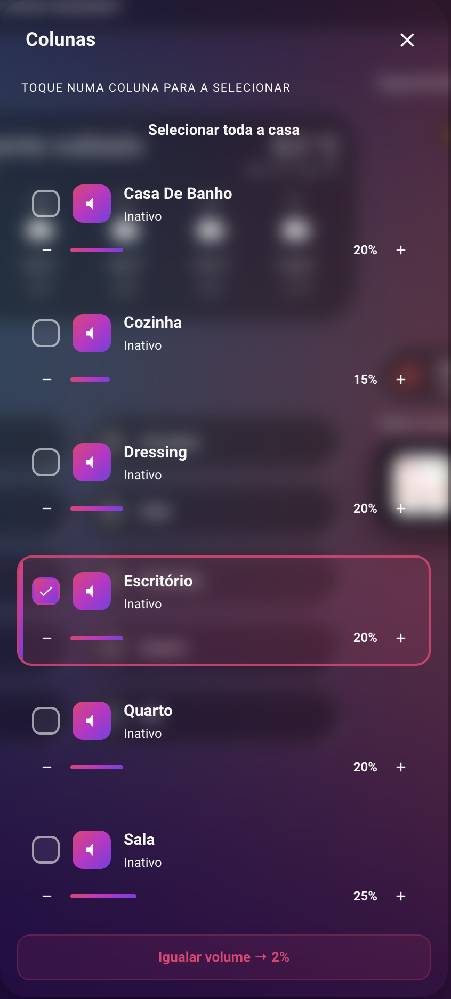
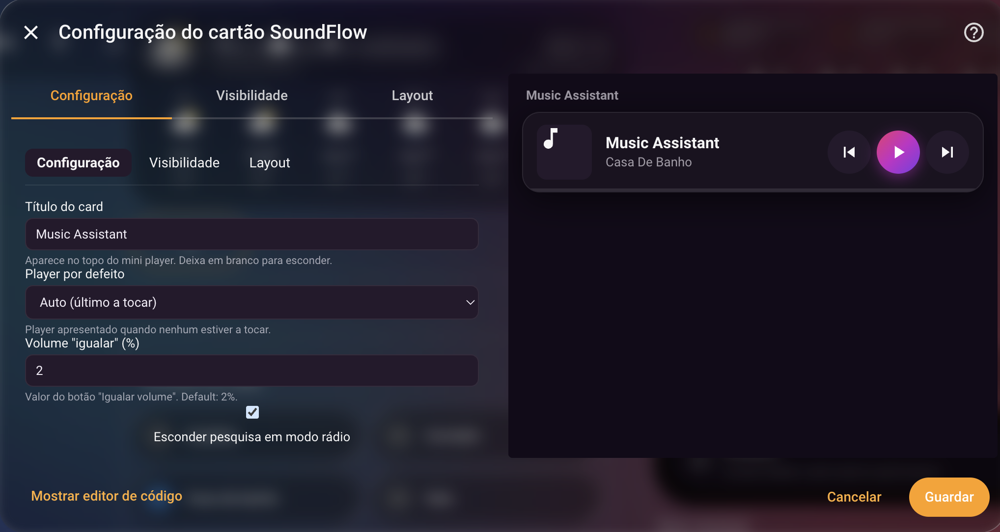
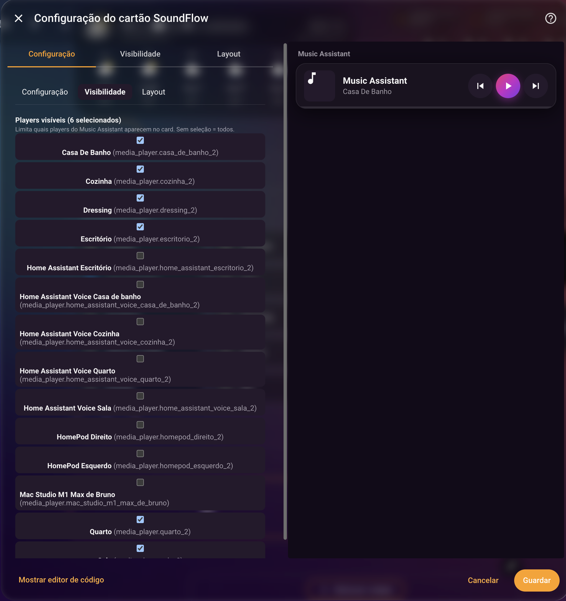

<div align="center">


# SoundFlow Card

**Elegant Lovelace card to control Music Assistant from your Home Assistant dashboard.**

[](https://github.com/hacs/integration)
[](LICENSE)

</div>

---

## ✨ Features

- 🎵 **Dashboard mini player** — opens a full modal in one tap
- 🎨 **SoundFlow identity** — magenta → purple → violet gradient
- 🌍 **Automatic language** (PT/EN) based on Home Assistant locale
- 🌗 **Auto light/dark theme** — follows HA or the OS
- 🎶 **Provider auto-discovery** — Apple Music, Spotify, Tidal, Qobuz, Deezer, YouTube Music, TuneIn, SoundCloud, Plex, Jellyfin, Subsonic, Local Files, and more
- 📻 **Favorite radios** one click away
- ⭐ **Music Assistant favorites** — Playlists, Albums, Artists, Tracks
- 🗂️ **Library tracks by provider** — shuffle all tracks from each individual account (e.g. *Apple Music — Bruno*, *Apple Music — Maria*) instead of a single mixed list
- 🔍 **Context-aware search** — first inside the selected library, then in the provider (manual search button, no auto-search)
- 🔀 **Shuffle-all** when picking a playlist or "All tracks"
- 🔊 **Multi-speaker sync** — automatically groups/ungroups speakers as you select them
- 🎯 **Dynamic leader** — chosen at random; queue is transferred automatically if the leader is removed (music never stops)
- 🎚️ **Equalize volume** with one tap (configurable target)
- 🔇 **Global volume & mute** of the selected speakers + per-speaker control in the popup
- ⚙️ **Visual editor** with Configuration, Visibility, and Layout tabs

## 📋 Requirements

- Home Assistant **2024.1.0** or later
- [Music Assistant](https://github.com/music-assistant/hass-music-assistant) integration configured (server addon + HA integration)
- At least one music provider configured and one media player exposed
- **Required:** [Music Assistant Queue Actions](https://github.com/droans/mass_queue) (`mass_queue`) — install via HACS as a Custom Repository (Integration). Enables per-provider track filtering, richer player metadata, and the *Library → Tracks by provider* view. Without it the card still loads but several features are degraded.

### ⚠️ Sonos speakers — important

If you control Sonos speakers through Music Assistant, set the **output protocol** to **MP3** on each Sonos player (Music Assistant UI → Settings → Players → *your Sonos* → Output protocol → MP3).

The default output uses HTTP chunked encoding without `Content-Length`, which causes Sonos to throw `ERROR_BUFFERING` and silently stop playback when the player is part of a group. MP3 output ships proper headers and works reliably with grouped Sonos.

You also need the **Sonos provider** active in Music Assistant (Settings → Providers → Add → SONOS). Without it Music Assistant falls back to AirPlay for Sonos speakers, which doesn't scale to multi-room sync.

## 📦 Installation

### Via HACS (recommended)

1. Open HACS in Home Assistant → **Frontend**
2. Menu (⋮) → **Custom repositories**
3. URL: `https://github.com/soundflow-dev/soundflow-card`
4. Category: **Lovelace** → **Add**
5. Search "SoundFlow Card" → **Download**
6. Hard-reload the browser (`Ctrl+Shift+R` / `Cmd+Shift+R`)

### Manual

1. Download `dist/soundflow-card.js` from the [latest release](https://github.com/soundflow-dev/soundflow-card/releases)
2. Place it at `<config>/www/soundflow-card.js`
3. **Settings → Dashboards → Resources**:
   - URL: `/local/soundflow-card.js`
   - Type: JavaScript Module

## 🚀 Usage

### Minimal

```yaml
type: custom:soundflow-card
```

The card auto-discovers players, providers, and favorites. That's it.

### Full

```yaml
type: custom:soundflow-card
title: SoundFlow                     # optional, shown above the mini player
default_player: media_player.sala    # optional ('auto' = last played)
equalize_volume: 2                   # optional, % target for the Equalize button (default: 2)
hide_radio_search: true              # optional, hide search in radio mode
players:                              # optional, restricts which speakers appear
  - media_player.sala
  - media_player.cozinha
  - media_player.quarto
```

## 🎨 Screenshots

<table>
  <tr>
    <td align="center" width="50%">
      <strong>Mini player</strong><br>
      <sub>Lives on your dashboard — tap to open the full modal.</sub><br><br>
      
    </td>
    <td align="center" width="50%">
      <strong>Main view</strong><br>
      <sub>Now playing, source picker, speakers, search, and volume controls.</sub><br><br>
      
    </td>
  </tr>
  <tr>
    <td align="center">
      <strong>Source picker — Library</strong><br>
      <sub>Favorite radios, MA favorites, full library (drilled by provider).</sub><br><br>
      
    </td>
    <td align="center">
      <strong>Speakers</strong><br>
      <sub>Pick the speakers to play on. Tap to add/remove from the active group.</sub><br><br>
      
    </td>
  </tr>
  <tr>
    <td align="center">
      <strong>Editor — General</strong><br>
      <sub>Title, default player, equalize target, search visibility.</sub><br><br>
      
    </td>
    <td align="center">
      <strong>Editor — Visibility</strong><br>
      <sub>Pick which Music Assistant players appear in the card.</sub><br><br>
      
    </td>
  </tr>
</table>

> Screenshots taken on a Portuguese-locale Home Assistant. The card auto-translates to English when HA is set to EN.

## 🛠️ Local build

```bash
python3 build.py
```

Builds `dist/soundflow-card.js`. No Node or npm required.

Node alternative:

```bash
npm install
npm run build
```

## 🐛 Reporting issues

Open an [issue](https://github.com/soundflow-dev/soundflow-card/issues) with:
- SoundFlow Card / HA / Music Assistant versions
- Description and steps to reproduce
- Screenshots if relevant

## 📄 License

[MIT](LICENSE)

## 💚 Credits

Built on top of the [Music Assistant integration](https://github.com/music-assistant/hass-music-assistant).

---

<div align="center">Made with 🎵 for the Home Assistant community</div>
